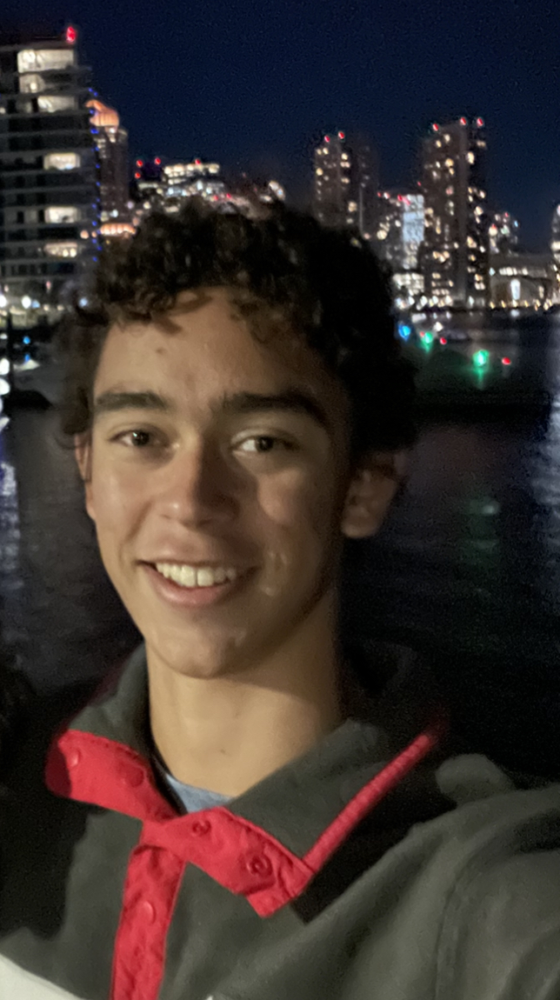
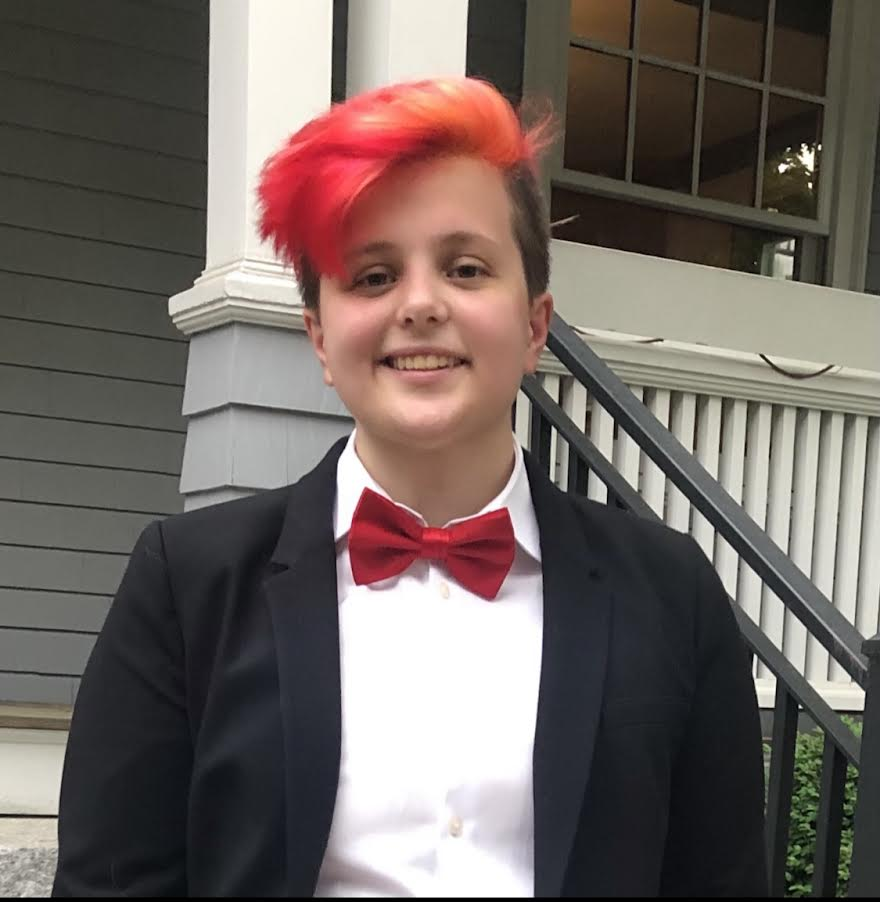
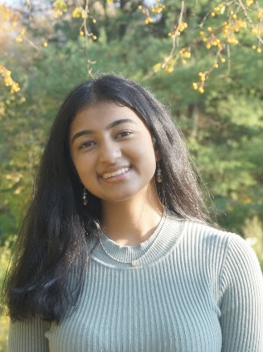
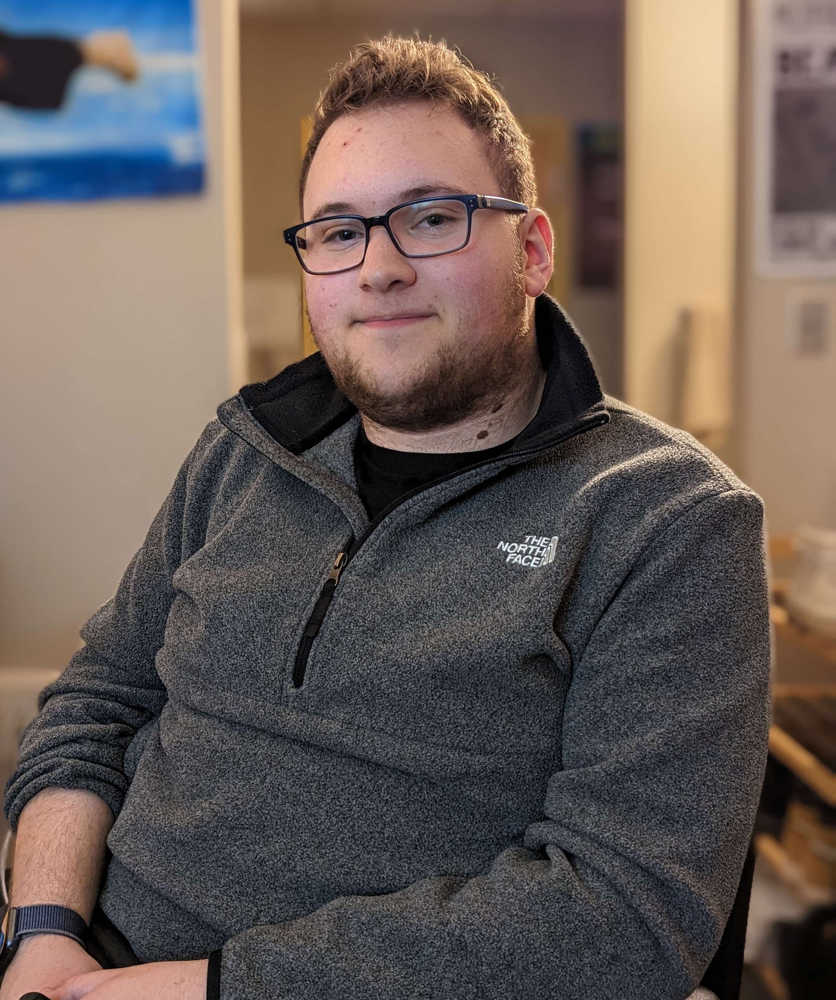
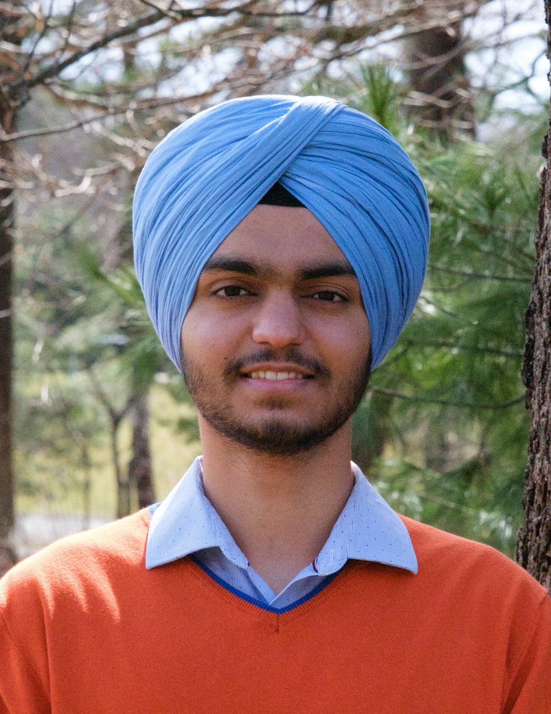

---
title: About Us
layout: template
filename: aboutUS.md
--- 
[<-Back](./index.md) 

# About the Creators

**[Tyler Ewald](https://github.com/tylerkwald)** 
Mechanical
Tyler is a second year engineering student interested in mechanical as well as electrical engineering. On this project, he focused mainly on designing and CADing of the mechanisms and arcade case. In addition, Tyler worked on the assembly of the arcade and gained a lot of new skills with working with integrating systems as well as furthering shop botting skills and work with various saws.

**[Clay Oates](https://github.com/HoneyBunches52)** 
Mechanical
Clay is a second year mechanical engineering student at Olin College. For this project, he mainly worked on the moles, especially the buttons inside of them. Making a system that allowed the buttons to be pushed from any point on the mole’s head required quicker iteration, which also helped Clay gain more experience designing prototypes and problem workarounds. He learned a lot about working with different types of materials including plastic and a variety of fabrics. 

**[Adhishri Hande](https://github.com/adhishrihande)** 
Mechanical
Adhishri is a mechanical engineer at Olin College. She mainly worked on the pneumatic mechanism on the inside of the arcade box, as well as helped design the outer structure. She learned a lot about dual acting pneumatics, as this was her first time using them, and learned a lot of new useful tools in SOLIDWORKS. 

**[Sam Mendelson](https://github.com/iamtheyammer)** 
Electrical
[...]

 

**[Anmol Sandhu](https://github.com/AnmolRattanSingh)**
Software
Anmol is a software engineer at Olin College. He mainly worked on the website for the arcade game display and added features like player name input, game timer and a leaderboard. He learned a lot about web-sockets, PySerial and React. He also learned a lot about integrating software with electrical and managing game state.

### Individual Learning Goals
- Tyler:
    1. Utilizing the sprint format for rapid prototyping and idea generation
    2. Deciding the extent of sprints based on overall timeline.

- Clay:
    1. Working with different materials
    2. Practicing quick iteration to leave more time for integration

- Adhishri: 
    1. Learning new tools in Solidworks 
    2. Practicing iterating quickly
- Sam: 
    1. Learn more about MOSFETS and controlling high-voltage circuits
    2. Integrate software + hardware
- Anmol: 
    1. Learn more about web-sockets and React. 
    2. Write clean and well-documented code. 