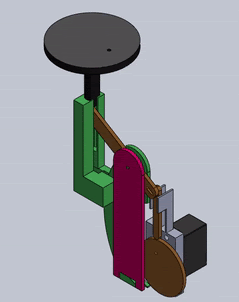
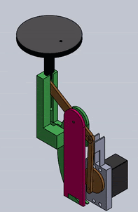
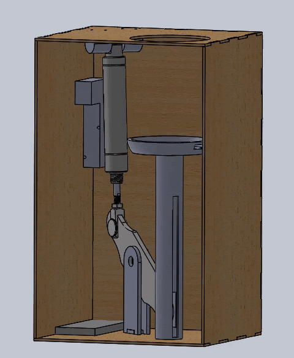
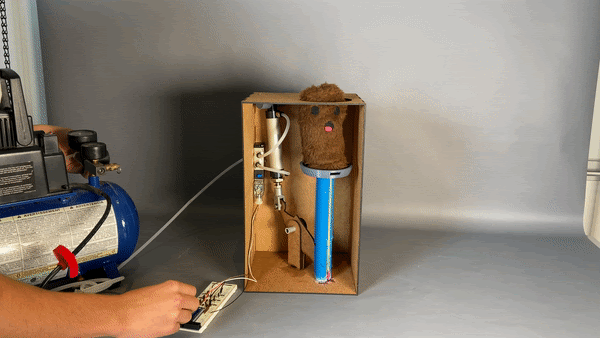
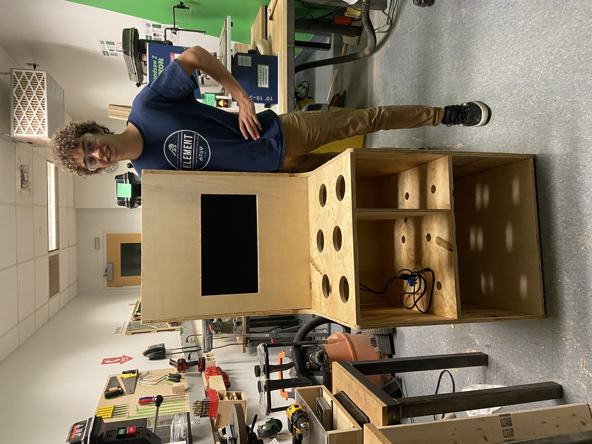
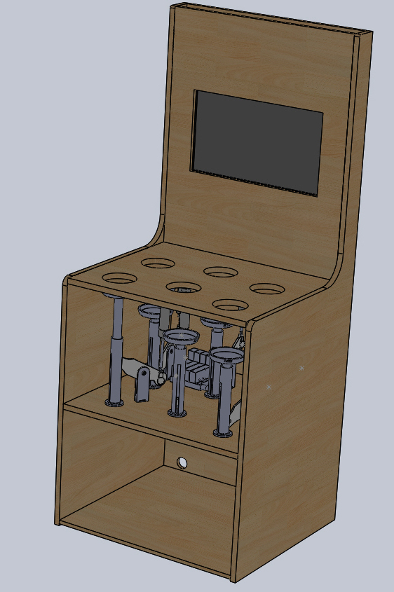
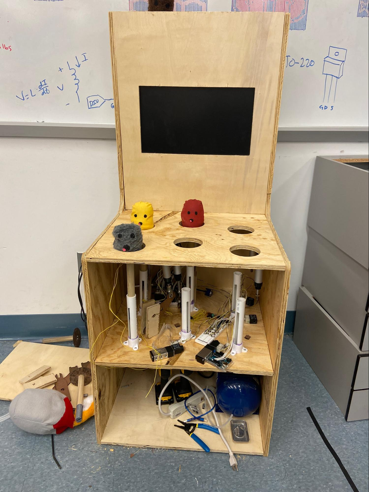

---
title: Whac-A-Mole
layout: template
filename: electrical.md
--- 
- [<-Back](./index.md) 

# Electical System Breakdown

## Sprint 1

                      

In the first sprint, we focused on getting the Arduino to control a single mole using a servo motor. This involved connecting the servo motor to the Arduino and writing the necessary code to control the movement of the servo. The team was able to successfully get the servo to move the mole up and down, simulating the movement of a mole in a real-life whack-a-mole game, albeit much more slowly than we'd like in the final version.

## Sprint 2

                      

In the second sprint, the team added the pneumatics to the circuit, connecting the Arduino to a MOSFET that controlled a solenoid, finally controlling a pneumatic system that uses compressed air to push the mole up and down through the hole. This allowed the mole to move more quickly and smoothly, creating a more realistic, challenging, and fun game.

## Sprint 3

                            

In the third sprint of the project, we expanded the circuit from one mole to six moles. This involved adding multiple solenoids, MOSFETs, and buttons to the circuit and writing code to control the movement of each mole individually and randomly. We got the Arduino to control the movement of all six moles, allowing multiple moles to go up and down with a hit or randomly with time, which increased the challenge and excitement of the game.

## Final Sprint

                            

In the final sprint of the project, we focused on getting the moles to move up and down randomly, as this is an essential element of the game. To achieve this, we wrote code to randomly move each mole, simulating the unpredictable behavior of real moles.

The team also spent a significant amount of time debugging and playtesting the game to ensure that it was fun and challenging to play. This involved identifying and fixing any issues with the code or the circuit, as well as soliciting feedback from players and making adjustments to the game based on their suggestions.

As we playtested, we found that in addition to getting the moles to move up and down randomly, we also had to write code to make each mole time out for a short period after it gets hit or goes down randomly. This prevents players from hitting the same mole multiple times in quick succession and makes the game more challenging, further increasing randomness.

To implement this, we wrote code that kept track of the state of each mole (up or down) and the time it went into that state. When a mole was hit or went down randomly, the code would cause the mole to stay down for a predetermined amount of time before allowing it to pop up again. This created a more realistic and challenging gameplay experience, as players had to wait for the moles to pop up before they could hit them, and it made sure that one mole doesn't just keep coming up again and again.

Overall, the code that made each mole time out added an extra level of complexity and challenge to the game, making it more realistic and engaging for players. This was an important element of the final sprint, as it helped to ensure that the game was fun and satisfying to play. It was really surprising how much of a difference this timeout code made.