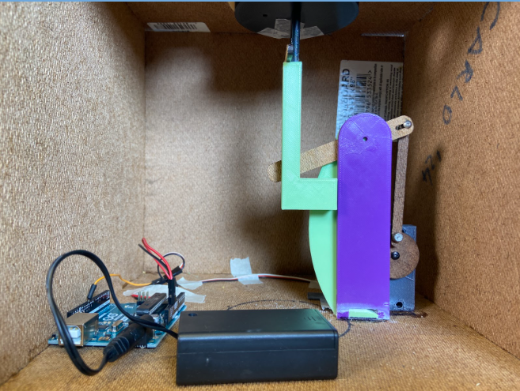
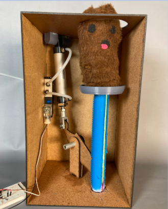

---
title: Whac-A-Mole
layout: template
filename: index.md
--- 
# Whac-A-Mole
## Contributors: Tyler Ewald, Clay Oates, Adhishri Hande, Sam Mendelson, Anmol Sandhu

### Project Description
[...]

### Project Sprints
Our game leverages three main features in order to ensure a smooth gameflow for users: OpenCV, pygame, and OpenPose. Below is a detailed description of how each features is used within our game:
- Sprint 1: [...]

  

- Sprint 2: [...]

  

### Project Goals
MVP:
1. Six moles randomly going up and down using a pneumatic system
2. When moles are hit, score is calculated for the player
3. A monitor that displays score

### Individual Learning Goals
- Tyler:
    1. Utilizing the sprint format for rapid prototyping and idea generation
    2. Deciding the extent of sprints based on overall timeline.

- Clay:
    1. Working with different materials
    2. Practicing quick iteration to leave more time for integration

- Adhishri: 
    1. Learning new tools in Solidworks 
    2. Practicing iterating quickly
- Sam: 
    1. Learn more about MOSFETS and controlling high-voltage circuits
    2. Integrate software + hardware
- Anmol: 
    1. Learn more about web-sockets and React. 
    2. Write clean and well-documented code

### Project Demo

[Whac-A-Mole](https://www.youtube.com/watch?v=Sm--6dE8Xso)

### Project Subteams

- [Mechanical](./mechanical.md)

### About the Creators

 
**[Tyler Ewald](https://github.com/idk)** 
[...]

  

**[Clay Oates](https://github.com/idk)** 
[...]

     

**[Adhishri Hande](https://github.com/idk)** 
[...]

     

**[Sam Mendelson](https://github.com/iamtheyammer)** 
[...]

     

   

**[Anmol Sandhu](https://github.com/AnmolRattanSingh)**
[...] 

   