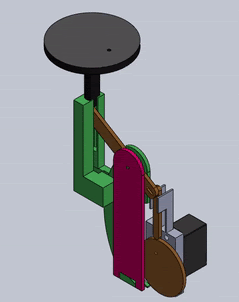
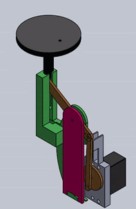
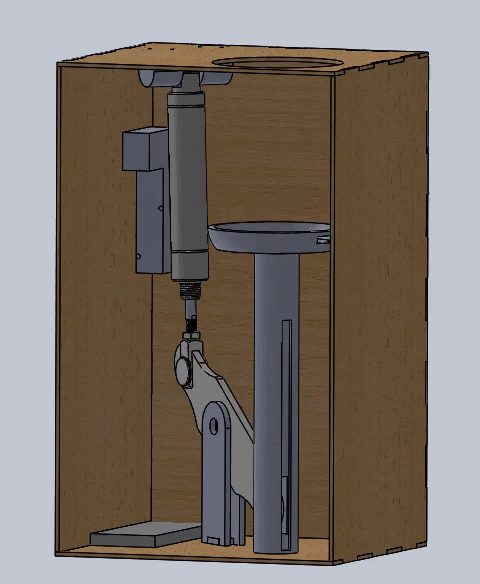
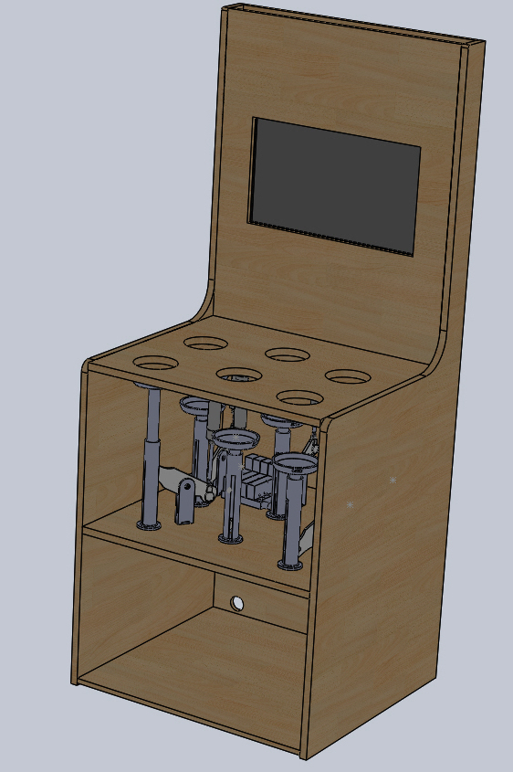

---
title: Whac-A-Mole
layout: template
filename: mechanical.md
--- 
### Mechanical Systems Breakdown

## Sprint 1

           

For the first sprint, we wanted to create a proof of concept. We had a cam system connected to a bar-linkage that pushed a mole up and down. A lot of our parts were made of PLA (3d printed) and fiberboard (laser cutted.) 

## Sprint 2

           

For Sprint 2, we were able to hook up one pneumatic piston to allow one mole to go up and down with a larger linkage system. The pneumatic piston is connected to solenoid, which helps control whether there is pressurized air or atmospheric air in the system, which causes the mole to shoot up or come down. 

## Sprint 3

         

For Sprint 3, we did make quite a jump in scale. We were able to get three moles to move up and down using a pneumatic system, air compressor, and solenoids. We were also able to create a real arcade console looking structure, with a monitor on the inside! This gives players of our whack-a-mole game the feeling that they are at a real arcade! As sustainability was something we wanted to keep in mind, we 3-d printed only one kind of piece. Also, there is no glue used in the mechanical system since we want to take the entire thing a part at the end of the project, to allow others to use our scrap wood and other parts. This minimizes waste and the collection of old, sitting projects, where the parts can be reused. 

## Final Sprint

              

For the final, the mech e team was able to connect six moles to the pneumatic system. With the offset linkage, we were able to minimize damage to the pneumatics themselves as there would be less direct force put onto them. At the end the system looked like a real arcade game, and was satisfying to see a finalized product we were proud of. (if we add a curtain or acrylic front, add info about that.)
