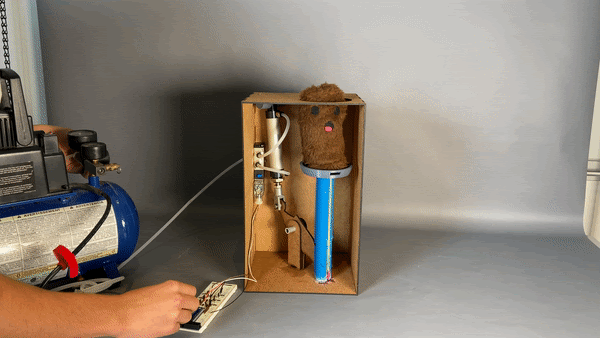

---
title: Whac-A-Mole
layout: template
filename: mechanical.md
--- 
[<-Back](./index.md) 

# Mechanical Systems Breakdown

## Sprint 1

For the first sprint, we wanted to create a proof of concept. We had a cam system connected to a bar-linkage that pushed a mole up and down. A lot of our parts were made of PLA (3d printed) and fiberboard (laser cutted.) 

## Sprint 2

For Sprint 2, we were able to hook up one pneumatic piston to allow one mole to go up and down with a larger linkage system. The pneumatic piston is connected to solenoid, which helps control whether there is pressurized air or atmospheric air in the system, which causes the mole to shoot up or come down. This sprint taught us to rely less on glue and to use utilizes more screws in the final for more durability and robustness for the 3rd sprint. 

## Sprint 3

For Sprint 3, we did make quite a jump in scale. We were able to get three moles to move up and down using a pneumatic system, air compressor, and solenoids. We were also able to create a real arcade console looking structure, with a monitor on the inside! This gives players of our whack-a-mole game the feeling that they are at a real arcade! As sustainability was something we wanted to keep in mind, we 3-d printed only one kind of piece. Also, there is no glue used in the mechanical system since we want to take the entire thing a part at the end of the project, to allow others to use our scrap wood and other parts. This minimizes waste and the collection of old, sitting projects, where the parts can be reused. 

## Final Sprint

For the final, the mech e team was able to connect six moles to the pneumatic system. With the offset linkage, we were able to eliminate damage to the pneumatics themselves as there would be torque applied if connected directly (if a player hit a mole at an angle). At the end the system looked like a real arcade game, and it was satisfying to see a finished product we were proud of. 

# Moles System Breakdown

## Mole Design Breakdown

The mole in the first sprint was simply a stuffed animal created from scrap fabric. This design was mainly to test if making a stuffed animal would help reduce the force on the pneumatic system by absorbing some of it when it compressed. Although the first mole didn’t have any special features, it provided proof of concept.

   

First Mole and Hammer

In the second sprint, a button was added to the top of a second mole. When the first mole was made, we originally thought that we would incorporate some kind of button underneath it. However, this design seemed to be impractical as we could only find small buttons that met our needs, meaning the player would have to be very precise to hit the button. So to address this issue, we designed a button holder that could be sewed to the top of the mole.

Button Holster

This holster was then attached to the top of the mole shown in sprint 2. However in this version, the button could only be pressed if the player hit the top of the mole directly. Therefore the design didn’t change the issue that a player had to be very precise with their hits in order to get points.

Second Mole (Sprint 2)

To specifically address this issue, we looked into possible designs that would allow one button to be pressed from anywhere on the top of the mole’s head. At first, we didn’t have many solutions, and then out of nowhere an idea popped up. Why not use ball pit balls? Honestly, I don’t remember where that thought came from, but it was a game changer. We called a place with a ball pit called Jam Time, and asked if we could use some of their balls for a college project. They said yes, and the whole team went to pick them up. Although we originally thought that we only needed 3, luckily Jam Time gave us 8. The first design incorporating the ball pit balls didn’t work as it only used half the ball. Instead of letting the shell that the half the ball created move freely, the stuffing inside the mole stopped it from moving. This design didn’t work at all and the button wouldn’t press.

The next attempt was closer to the final version. It involved both halves of the balls being stacked on top of eachother. The top one was attached to the top of the mole as well as the button, while the bottom sat freely with stuffing underneath it. This worked slightly better than the first, but the more it was hit, the more the bottom piece moved around and no longer supported the button’s holster. 

To fix the movement, we used hot glue to attach the holster to the ball. The hot glue allowed the two pieces to melt slightly and connect well. 

The final button-ball system. Here the mole is flipped inside out, so the system is visible.
   

Once the system was fully operational, all 6 moles were completed and sewed onto the system itself. Each pneumatics system had a plate with a bunch of holes so that the mole could be sewed to it easily.

5 out of 6 moles before they were attached to the overall system

Throughout the testing and playing process, the moles began to fall apart slightly. This was due to the upholstery thread that held the button at the top breaking. With nothing holding it in place, the button moved around until it was no longer under the ball’s shell. The other common problem was the wires disconnecting from the buttons. We’re not sure why, but the soldering sometimes came off or the wires broke. Once those happened, the mole could only be fixed by being taken apart. Overall though, the design held up well as only two of the moles broke after about two hours of people smashing them on top of previous testing.
